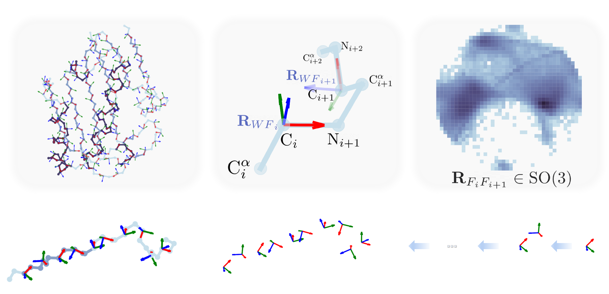

# FoldDoF: Utilizing the Major Degrees of Freedom of Protein Backbone Conformation

[Zefeng Zhu<sup>1,2,3</sup>](https://orcid.org/0000-0002-2761-3291), [Chen Song<sup>2,3</sup>](mailto:c.song@pku.edu.cn)<br/>
**{**<sup>1</sup>Peking University-Tsinghua University-National Institute of Biological Sciences Joint Graduate Program,
<sup>2</sup>Center for Quantitative Biology, 
<sup>3</sup>Peking-Tsinghua Center for Life Sciences **}**
Academy for Advanced Interdisciplinary Studies, Peking University </br>

<div align="center"></div>

## Installation

```bash
git clone https://github.com/NatureGeorge/FoldDoF.git

cd FoldDoF
pip install -e .
```

## Basic Usgae

> backbone reconstruction from idealized peptide isomers as example

```python
import gemmi
from folddof import to_backbone, to_bb_mode, to_rottrans, to_rottrans_mode
from folddof.frame import PeptideUnitFrame
from folddof.io import get_coords_with_mask, savebb2pdb


st = gemmi.read_structure('3HSF.cif.gz')
st.remove_alternative_conformations()
chain = st[0].get_subchain("A")
full_threeletter_seq = st.get_entity_of(chain).full_sequence
chain = list(chain)
threeletter_seq = full_threeletter_seq[chain[0].label_seq-1:chain[-1].label_seq]
bb_coords, bb_masks = get_coords_with_mask(chain, atoms=('N','CA','C','O'))

global_rots, global_trans, ret_isomer, _, _ = to_rottrans(
    bb_coords, bb_masks, 
    to_rottrans_mode.PeptideUnitFrame, 
    rot_repr_is_q=True)

avg_isomer = PeptideUnitFrame.to_avg_loc_ca_ia1_wrt_n_ia1(ret_isomer)

avg_bb_coords = to_backbone(
    global_rots[None], 
    avg_isomer[None],
    mode=to_bb_mode.Pep_GlobalRots_IsoRots,
    rot_repr_is_q=True,
    ).squeeze(0)

savebb2pdb(threeletter_seq, avg_bb_coords, output_path=f'3HSF.0.A.avg.pdb')
```

For more usage examples, please turn to [./notebooks/](./notebooks/).

e.g. [./notebooks/folddof.pymanopt.ipynb](https://nbviewer.org/github/NatureGeorge/folddof/blob/main/notebooks/folddof.pymanopt.ipynb) for optimizing the backbone conformation on $\mathrm{SO(3)}^N$ manifold via $\mathrm{SO(3)}$ connection:

<video src="./assets/folddof.pymanopt.mp4" width="640" height="480" autoplay loop muted controls></video>

## For FrameFlow Variants

### Installation

```bash
git clone https://github.com/NatureGeorge/PepFrameFlow.git

cd PepFrameFlow
pip install -e .
```

### Training

#### $\text{FrameFlow}$

```bash
python -W ignore experiments/train_se3_flows.py bb_repr=original scope_dataset.csv_path=./metadata/scope_metadata.clean.csv data.dataset=scope experiment.trainer.max_epochs=120 experiment.trainer.log_every_n_steps=10 experiment.checkpointer.monitor=valid/pseudo_score experiment.trainer.check_val_every_n_epoch=1 experiment.num_devices=2 experiment.checkpointer.save_last=False experiment.checkpointer.save_top_k=10 experiment.enable_wandb=False shared.samples_per_eval_length=10 shared.num_eval_lengths=30 interpolant.rots.igso3.sigma_grid.start=1.5 interpolant.rots.igso3.sigma_grid.end=1.5 interpolant.rots.igso3.sigma_grid.steps=1
```

#### $\text{FrameFlow}_{\text{Pep}}$

```bash
python -W ignore experiments/train_se3_flows.py bb_repr=global_pep scope_dataset.csv_path=./metadata/scope_metadata.clean.csv data.dataset=scope experiment.trainer.max_epochs=120 experiment.trainer.log_every_n_steps=10 experiment.checkpointer.monitor=valid/pseudo_score experiment.trainer.check_val_every_n_epoch=1 experiment.num_devices=2 experiment.checkpointer.save_last=False experiment.checkpointer.save_top_k=10 experiment.enable_wandb=False shared.samples_per_eval_length=10 shared.num_eval_lengths=30 interpolant.rots.igso3.sigma_grid.start=1.5 interpolant.rots.igso3.sigma_grid.end=1.5 interpolant.rots.igso3.sigma_grid.steps=1
```

#### $\text{FrameFlow}_{\text{Pep}}^{\text{Rel}}$

```bash
python -W ignore experiments/train_se3_flows.py bb_repr=global_pep scope_dataset.csv_path=./metadata/scope_metadata.clean.csv data.dataset=scope experiment.trainer.max_epochs=120 experiment.trainer.log_every_n_steps=10 experiment.checkpointer.monitor=valid/pseudo_score experiment.trainer.check_val_every_n_epoch=1 experiment.num_devices=2 experiment.checkpointer.save_last=False experiment.checkpointer.save_top_k=10 experiment.enable_wandb=False shared.samples_per_eval_length=10 shared.num_eval_lengths=30 interpolant.rots.igso3.sigma_grid.start=1.5 interpolant.rots.igso3.sigma_grid.end=1.5 interpolant.rots.igso3.sigma_grid.steps=1 model.relative_pep_trans_on_ipa_update=True
```

### Inference

#### Optional Prerequisite

* [ESMFold](https://huggingface.co/facebook/esmfold_v1)
* [ProteinMPNN](https://github.com/dauparas/ProteinMPNN)

If `inference.samples.seq_per_sample` > 0, you should install ESMFold and ProteinMPNN. By default, `inference.samples.seq_per_sample` is 8.

#### Checkpoint Paths

```bash
export frameflow_ckpt_path=weights/frameflow.ckpt
export frameflow_pep_ckpt_path=weights/frameflow.pep.ckpt
export frameflow_pep_rel_ckpt_path=weights/frameflow.pep.rel.ckpt
```

Note: you can also specified your own model path.

#### $\text{FrameFlow}$

```bash
for num_timesteps in 10 20 50 100 200 300 400 500; do
    python -W ignore experiments/inference_se3_flows.py -cn inference_unconditional bb_repr=original inference.ckpt_path="$frameflow_ckpt_path" inference.samples.samples_per_length=10 inference.num_gpus=4 inference.samples.seq_per_sample=8 inference.interpolant.sampling.num_timesteps="$num_timesteps" inference.samples.min_length=60 inference.samples.max_length=128 inference.samples.length_step=1 inference.samples.length_subset=null
done
```

#### $\text{FrameFlow}_{\text{Pep}}$

```bash
for num_timesteps in 10 20 50 100 200 300 400 500; do
    python -W ignore experiments/inference_se3_flows.py -cn inference_unconditional bb_repr=global_pep inference.ckpt_path="$frameflow_pep_ckpt_path" inference.samples.samples_per_length=10 inference.num_gpus=4 inference.samples.seq_per_sample=8 inference.interpolant.sampling.num_timesteps="$num_timesteps" inference.samples.min_length=61 inference.samples.max_length=129 inference.samples.length_step=1 inference.samples.length_subset=null
done
```

#### $\text{FrameFlow}_{\text{Pep}}^{\text{Rel}}$

```bash
for num_timesteps in 10 20 50 100 200 300 400 500; do
    python -W ignore experiments/inference_se3_flows.py -cn inference_unconditional bb_repr=global_pep inference.ckpt_path="$frameflow_pep_rel_ckpt_path" inference.samples.samples_per_length=10 inference.num_gpus=4 inference.samples.seq_per_sample=8 inference.interpolant.sampling.num_timesteps="$num_timesteps" inference.samples.min_length=61 inference.samples.max_length=129 inference.samples.length_step=1 inference.samples.length_subset=null model.relative_pep_trans_on_ipa_update=True
done
```

The resulting directories are `inference_outputs/hallucination_scope/*/*/unconditional/run_*`.

### Analysis

> modified scripts of [ReQFlow](https://github.com/AngxiaoYue/ReQFlow).

```bash
python analysis/all_metric_calculation.py --inference_dir "$your_result_dir" --script_path analysis/run_foldseek_parallel.sh --dataset_dir $your_pdb100_dir --type FrameFlow
```

Note that you should install `foldseek` and prepare the PDB100 database (specify the `$your_pdb100_dir`) before running above script (https://github.com/steineggerlab/foldseek?tab=readme-ov-file#databases).

#### Aggregate the Analysis Results:

Please turn to [./notebooks/frameflow.variants.analysis.ipynb](./notebooks/frameflow.variants.analysis.ipynb).